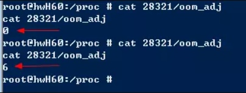
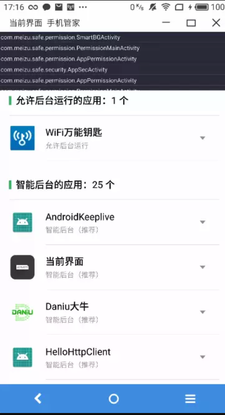

#### 阿里巴巴 进程保活如何做到，你们保活率有多高

> 本专栏专注分享大型Bat面试知识，后续会持续更新，喜欢的话麻烦点击一个star

#### 前言

进程保活的关键点有两个，一个是进程优先级的理解，优先级越高存活几率越大。二是弄清楚哪些场景会导致进程会kill，然后采取下面的策略对各种场景进行优化：

1. 提高进程的优先级
2. 在进程被kill之后能够唤醒

#### 进程优先级

Android一般的进程优先级划分：
 1.前台进程 (Foreground process)
 2.可见进程 (Visible process)
 3.服务进程 (Service process)
 4.后台进程 (Background process)
 5.空进程 (Empty process)
 这是一种粗略的划分，进程其实有一种具体的数值，称作oom_adj，注意：数值越大优先级越低：


- 红色部分是容易被回收的进程，属于android进程
- 绿色部分是较难被回收的进程，属于android进程
- 其他部分则不是android进程，也不会被系统回收，一般是ROM自带的app和服务才能拥有

如何查看某个进程的oom_adj数值呢？
 oom_adj 存储在proc/PID/oom_adj文件中，其中PID是进程的id，直接 adb shell进入手机根目录查看这个文件即可。

演示一下：以我自己的项目为例，app中有两个进程，一个是主进程，另一个是运行service的进程取名为:remote。首先用android studio查看每个进程的PID：


然后分别查看app在前台，app退到后台，这2中场景主进程的oom_adj数值：




image.png

 可见，当app在前台时 oom_adj = 0，对应上面的表格是前台进程。

 当app退到后台时，oom_adj = 6，对应后台进程。 

然后查看运行着service的进程：


ok，知道了进程优先级的概念以及如何查看优先级，我们就可以对app进程优化，然后通过查看这个数值判断我们的优化是否有效果。

#### 进程被kill的场景

###### 1.点击home键使app长时间停留在后台，内存不足被kill

处理这种情况前提是你的app至少运行了一个service，然后通过Service.startForeground() 设置为前台服务，可以将oom_adj的数值由4降低到1，大大提高存活率。

- 要注意的是android4.3之后Service.startForeground() 会强制弹出通知栏，解决办法是再启动一个service和推送共用一个通知栏，然后stop这个service使得通知栏消失。
- Android 7.1之后google修复这个bug，目前没有解决办法
   下面的代码放到你的service的onStartCommand方法中：

```
        //设置service为前台服务，提高优先级
        if (Build.VERSION.SDK_INT < 18) {
            //Android4.3以下 ，此方法能有效隐藏Notification上的图标
            service.startForeground(GRAY_SERVICE_ID, new Notification());
        } else if(Build.VERSION.SDK_INT>18 && Build.VERSION.SDK_INT<25){
            //Android4.3 - Android7.0，此方法能有效隐藏Notification上的图标
            Intent innerIntent = new Intent(service, GrayInnerService.class);
            service.startService(innerIntent);
            service.startForeground(GRAY_SERVICE_ID, new Notification());
        }else{
            //Android7.1 google修复了此漏洞，暂无解决方法（现状：Android7.1以上app启动后通知栏会出现一条"正在运行"的通知消息）
            service.startForeground(GRAY_SERVICE_ID, new Notification());
        }
```

经过改进之后，再来看下这个后台service进程的oom_adj，发现被提升为前台进程。


image.png


###### 2.在大多数国产手机下，进入锁屏状态一段时间，省电机制会kill后台进程

这种情况和上面不太一样，是很过国产手机rom自带的优化，当锁屏一段时间之后，即使手机内存够用为了省电，也会释放掉一部分内存。

策略：注册广播监听锁屏和解锁事件， 锁屏后启动一个1像素的透明Activity，这样直接把进程的oom_adj数值降低到0，0是android进程的最高优先级。 解锁后销毁这个透明Activity。这里我把这个Activity放到:remote进程也就是我那个后台服务进程，当然你也可以放到主进程，看你打算保活哪个进程。


image.png

我们可以写一个KeepLiveManager来负责接收广播，维护这个Activity的常见和销毁，注意锁屏广播和解锁分别是：ACTION_SCREEN_OOF和ACTION_USER_PRESENT，并且只能通过动态注册来绑定，并且是绑定到你的后台service里面,onCreate绑定,onDestroy里面解绑

配好之后把手机锁屏，看下:remote进程的oom_adj：


image.png

###### 3. 用户手动释放内存：包括手机自带清理工具，和第三方app（360，猎豹清理大师等）

清理内存软件会把 优先级低于 前台进程(oom_adj = 0)的所有进程放入清理列表，而当我们打开了清理软件就意味着其他app不可能处于前台。所以说理论上可以kill任何app。
 以360安全卫士为例，打开内存清理：


因此这类场景唯一的处理办法就是加入 手机rom 白名单，比如你打开小米，魅族的权限管理 -> 自启动管理可以看到 QQ，微信，天猫默认被勾选，这就是厂商合作。那我们普通app可以这么做：在app的设置界面加一个选项，提示用户自己去勾选自启动，我封装了一个工具类给出国内各厂商的自启动的Intent跳转方法：

```
/**
 * Created by carmelo on 2018/3/17.
 * 国内手机厂商白名单跳转工具类
 */

public class SettingUtils {

    public static void enterWhiteListSetting(Context context){
        try {
            context.startActivity(getSettingIntent());
        }catch (Exception e){
            context.startActivity(new Intent(Settings.ACTION_SETTINGS));
        }
    }

    private static Intent getSettingIntent(){

        ComponentName componentName = null;

        String brand = android.os.Build.BRAND;

        switch (brand.toLowerCase()){
            case "samsung":
                componentName = new ComponentName("com.samsung.android.sm",
                        "com.samsung.android.sm.app.dashboard.SmartManagerDashBoardActivity");
                break;
            case "huawei":
                componentName = new ComponentName("com.huawei.systemmanager",
                        "com.huawei.systemmanager.startupmgr.ui.StartupNormalAppListActivity");
                break;
            case "xiaomi":
                componentName = new ComponentName("com.miui.securitycenter",
                        "com.miui.permcenter.autostart.AutoStartManagementActivity");
                break;
            case "vivo":
                componentName = new ComponentName("com.iqoo.secure",
                        "com.iqoo.secure.ui.phoneoptimize.AddWhiteListActivity");
                break;
            case "oppo":
                componentName = new ComponentName("com.coloros.oppoguardelf",
                        "com.coloros.powermanager.fuelgaue.PowerUsageModelActivity");
                break;
            case "360":
                componentName = new ComponentName("com.yulong.android.coolsafe",
                        "com.yulong.android.coolsafe.ui.activity.autorun.AutoRunListActivity");
                break;
            case "meizu":
                componentName = new ComponentName("com.meizu.safe",
                        "com.meizu.safe.permission.SmartBGActivity");
                break;
            case "oneplus":
                componentName = new ComponentName("com.oneplus.security",
                        "com.oneplus.security.chainlaunch.view.ChainLaunchAppListActivity");
                break;
            default:
                break;
        }

        Intent intent = new Intent();
        intent.addFlags(Intent.FLAG_ACTIVITY_NEW_TASK);
        if(componentName!=null){
            intent.setComponent(componentName);
        }else{
            intent.setAction(Settings.ACTION_SETTINGS);
        }
        return intent;
    }
}
```

补充几点：

- 额外说下 自启动是什么意思？ 网上都是小米开启自启动就是加入白名单，其实根本不是这样的，经过实测就算app勾选自启动也会被内存优化加速清理掉，只不过进程会在半分钟后复活。

- 除了还有自启动还有一个设置就是电池管理，比如小米的神隐模式，这部分和自启动不同的是它是管理app在锁屏之后被省电机制杀死的场景，当然每家厂商也有对应的Intent跳转路径。

- 如何查找不同厂商的设置界面跳转Intent，比如上面的国内手机厂商白名单，给个方法：（前提是你有N多个不同手机，像我这样。。。）

  

  

  IMG_19700103_034546.jpg

在酷安应用市场下载一个叫 当前Activity 的app，打开后可以看到当前界面的className，例如：




image.png

就找到了魅族MX4 pro 后台权限的Activity。

#### 进程唤醒

分两种情况，一是主进程（含有Activity没有service），这种进程由于内存不足被kill之后，用户再次打开app系统会恢复到上次的Activity，这个不在本文话题之内。另一种是service的后台进程被kill，可以通过service自有api来重启service：

```
@Override
    public int onStartCommand(Intent intent, int flags, int startId) {
        //.....
        return START_STICKY;    // service被异常停止后，系统尝试重启service，不能保证100%重启成功
    }
```

配好START_STICKY后，通过android studio 释放进程的工具测试下，可以发现:remote进程被kill之后马上重启了：


但它不是100%保证重启成功，比如下面2种情况：（本人经过测试，这里就不放效果图了）

- Service 第一次被异常杀死后会在5秒内重启，第二次被杀死会在10秒内重启，第三次会在20秒内重启，一旦在短时间内 Service 被杀死达到5次，则系统不再拉起。
- 进程被取得 Root 权限的管理工具或系统工具通过 forestop 停止掉，无法重启。

#### 总结

本文通过两种 提高进程优先级的方法，针对锁屏 和非锁屏模式下进程在后台被kill的场景处理，把后台进程优先级提升到可见级别，基本可以保证绝大多数场景不会被kill。另外，针对含有service的进程被kill给出了可唤醒的办法。

最后，我将进程保活的代码上传到了Github，地址：
 [https://github.com/08carmelo/android-keeplive](https://link.jianshu.com?t=https%3A%2F%2Fgithub.com%2F08carmelo%2Fandroid-keeplive)

